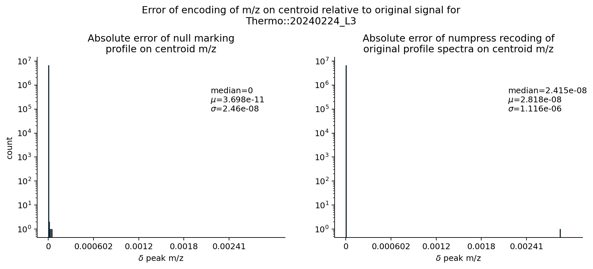

# mzPeak file format prototyping

This repository contains prototype implementations of the mzPeak format initially described in https://pubs.acs.org/doi/10.1021/acs.jproteome.5c00435.

**NOTE**: This is a **work in progress**, no stability is guaranteed at this point.

The primary work shown here is written in Rust at the repository root, including a library for reading and writing mzPeak files,
as well as command line tools for converting existing formats into mzPeak. There is a separate Python implementation in `python/`
which is a complete re-implementation for _reading_ mzPeak files using [`pyarrow`](https://arrow.apache.org/docs/python/index.html),
and the PyData stack. The Python codebase does not support writing at this time although this is subject to change in the future.

Other languages are planned in the future in rough order of priority:

- C++
- C#
- Java
- R
- JavaScript/WebAssembly

## Table of contents
- [mzPeak file format prototyping](#mzpeak-file-format-prototyping)
  - [Table of contents](#table-of-contents)
  - [High level overview](#high-level-overview)
    - [File level metadata](#file-level-metadata)
    - [Packed Parallel Tables](#packed-parallel-tables)
    - [Zero Run Stripping](#zero-run-stripping)
      - [Null Marking](#null-marking)
    - [Point Layout for Data Arrays](#point-layout-for-data-arrays)
    - [Chunked Layout for Data Arrays](#chunked-layout-for-data-arrays)
  - [Conversion Program](#conversion-program)

## High level overview

mzPeak is a archive of multiple [Parquet](https://parquet.apache.org/) files, stored directly in an _uncompressed_ [ZIP](<https://en.wikipedia.org/wiki/ZIP_(file_format)>)
archive. Each Parquet file describes a different facet of the stored mass spectrometry run. While the the data model draws on prior
art like mzML (https://peptideatlas.org/tmp/mzML1.1.0.html), it is not a direct re-implementation in a Parquet table. It does attempt
to re-use concepts like controlled vocabularies where feasible as well as arbitrary additional user metadata.

Components of an mzPeak archive:

- `spectra_metadata.mzpeak`: Spectrum level metadata and file-level metadata. Includes spectrum descriptions, scans, precursors, and selected ions using packed parallel tables.
- `spectra_data.mzpeak`: Spectrum signal data in either profile or centroid mode. May be in point layout or chunked layout which have different size and random access characteristics.
- `spectra_peaks.mzpeak` (optional): Spectrum centroids stored explicitly separately from whatever signal is in `spectra_data.mzpeak`, such as from instrument vendors who store both profile and centroid versions of the same spectra. This file may not always be present.
- `chromatograms_metadata.mzpeak` (optional): Chromatogram-level metadata and file-level metadata. Includes chromatogram descriptions, as well as precursors and selected ions using packed parallel tables.
- `chromatograms_data.mzpeak` (optional): Chromatogram signal data. May be in point layout or chunked layout which have different size and random access characteristics. Intensity measures with different units may be stored in parallel.

### File level metadata

mzPeak file-level metadata, including descriptions of the file's contents, the instrumentation, software, and data transformation pipeline are stored in the Parquet metadata segment as JSON documents. Several of these concepts are already covered by controlled vocabulary terms. See `schema/` for JSONSchemas for these elements.

### Packed Parallel Tables

The `spectra_metadata.mzpeak` and `chromatograms_metadata.mzpeak` store multiple schemas in parallel. In these Parquet files, the root schema is made up of several branched "group" or "struct" (Parquet vs. Arrow nomenclature) that may be null at any level.

### Zero Run Stripping

When storing spectrum data, some vendors will produce arrays with lots of "empty" regions filled with zero intensity values along a semi-regularly spaced m/z axis. These regions hold little information, so all but the first and last zero intensity points are removed. This is only meaningful for profile data.

#### Null Marking

For spectra with many small gaps, even zero run stripping leaves too much unhelpful information in the data. We can instead replace the flanking zero intensity points with `null` m/z and intensity values and Parquet will skip storing the expensive 32- and/or 64-bit values, retaining only the validity buffer bit flag. We can separately fit a simple m/z spacing model using weighted least squares of the form:

$$
    δ mz \sim β_0 + β_1 mz + β_2 mz^2 + ϵ
$$

or using the following Python code:
<details>

<summary>Python code for fitting the weighted least squares model</summary>

```python
class DeltaCurveRegressionModel:
    beta: np.ndarray

    def __init__(self, beta: np.ndarray):
        self.beta = beta

    @classmethod
    def fit(
        cls,
        mz_array,
        delta_array,
        weights: np.ndarray | None = None,
        threshold: float | None = None,
        rank: int = 2,
    ):
        if weights is None:
            weights = np.ones(len(mz_array))
        else:
            weights = weights

        if threshold is None:
            threshold = 1.0

        # Drop all entries where the gap between m/z values > threshold
        raw = mz_array[1:][delta_array <= threshold]
        w = weights[1:][delta_array <= threshold]
        y = delta_array[delta_array <= threshold]

        # Build the design matrix
        data = [data.append(np.ones_like(raw))]
        for i in range(1, rank + 1):
            data.append(raw**i)
        data = np.stack(data, axis=-1)

        # Use the QR decomposition to solve the weighted least squares problem
        # to estimate weights predicting δ m/z.
        # https://stats.stackexchange.com/a/490782/59613
        chol_w = np.sqrt(w)
        qr = np.linalg.qr(chol_w[:, None] * data)
        v = qr.Q.T.dot(chol_w * y)
        beta = solve_triangular(qr.R, v)

        # Numerically equivalent to and more stable than the direct inversion
        # beta = np.linalg.inv((data.T * w).dot(data)).dot(data.T * w).dot(y)
        return cls(beta)

    def predict(self, mz: float) -> float:
        acc = self.beta[0]
        for i in range(1, len(self.beta)):
            acc += self.beta[i] * mz ** i
        return acc
```

</details>

Then when reading the the null-marked data, use either the local median $δ mz$ or the learned model for that spectrum to compute the m/z spacing for singleton points to achieve an very accurate reconstruction. Because the non-zero m/z points remain unchanged, the reconstructed signal's peak apex or centroid should be unaffected. If the peak is composed of only three points including the two zero intensity spots, no meaningful peak model can be fit in any case so the minute angle change this would induce are still effectively lossless.




Keep in mind that all Numpress compression methods are still available and still provide superior size reduction, but carry this slightly larger loss of accuracy. Using a Numpress compression is a transformation that requires the [Chunked Layout](#chunked-layout-for-data-arrays).

### Point Layout for Data Arrays

When storing data arrays, the point layout stores the data as-is in parallel arrays alongside a repeated index column.

| spectrum_index | mz_array | intensity_array |
| :-----:        | :------: | :---------: |
| 1              | 213.2    | 1002 |
| 1              | 506.9    | 500 |
| 1              | 758.0    | 405 |
| ...            | ...      | ... |
| 2              | 329.1    | 50 |
| 2              | 516.5    | 5002 |
| 2              | 783.8    | 302 |

This layout is simple, but carries several advantages. Scalar columns are easily filtered along the page-level range index. This makes multi-dimensional queries easier to write and optimize. The arrays are transparently encoded and compressed by Parquet, so the data may still be stored compactly. The data must be stored as-is in order to use the page index so no additional obscuring transformations can be used. The [zero run stripping](#zero-run-stripping) and [null marking](#null-marking) methods may still be employed as they only remove non-meaningful points from the array.

### Chunked Layout for Data Arrays

When storing data arrays, the chunked layout treats one array, which must be sorted, as the "primary" axis, cutting the array into chunks of a fixed size along that coordinate space (e.g. steps of 50 m/z) and taking the same segments from parallel arrays. The primary axis chunks' start, end, and a repeated index are recorded as columns, and then each array may be encoded as-is or with an opaque transform (e.g. δ-encoding, Numpress). The start and end interval permits granular random access along the primary axis as well as the source index.

| spectrum_index | mz_array_start | mz_array_end | mz_array_chunk_values | intensity_array |
| :-----:        | :------: | :---------: |:--- | :---
| 1              | 200.0    | 250.0 | [0.0013, ..., 0.0013] | [...]
| 1              | 250.0    | 300.0 | [0.0014, ..., 0.0014] | [...]
| 1              | 500.0    | 550.0 | [0.0014, ..., 0.0015] | [...]
| ...            | ...      | ... | ... | ...
| 2              | 200.0    | 250.0 | [0.0013, ..., 0.0013] | [...]
| 2              | 350.0    | 400.0 | [0.0014, ..., 0.0014] | [...]
| 2              | 400.0    | 450.0 | [0.0013, ..., 0.0014] | [...]

This example uses a δ-encoding for the m/z array chunks' values, which can be efficiently reconstructed with very high precision for 64-bit floats. The m/z values within the `mz_array_chunk_values` list aren't accessible to the page index, but the start and end columns are. The chunk values are still subject to Parquet encodings so they can be byte shuffled as well which further improves compression.


## Conversion Program

To run the Rust program to convert other mass spectrometry data file formats to mzPeak:

`cargo r -r --example convert -- [OPTIONS] <FILENAME>`. Alternatively, run `cargo install --path .` and the `mzpeak_prototyping` executable will be available on your `$PATH`, with `mzpeak_prototyping convert` running the same program. The program can read mzML, MGF, and Bruker TDF files, passing `--features thermo` to `cargo` enables reading Thermo RAW files as well if a .NET runtime is available.

```
Convert a single mass spectrometry file to mzpeak format

Usage: convert [OPTIONS] <FILENAME>

Arguments:
  <FILENAME>  Input file path

Options:
  -m, --mz-f32
          Encode the m/z values using float32 instead of float64
  -d, --ion-mobility-f32
          Encode the ion mobility values using float32 instead of float64
  -y, --intensity-f32
          Encode the intensity values using float32
      --intensity-numpress-slof
          Encode the intensity values using the Numpress Short Logged Float transform. This requires the chunked encoding.
  -i, --intensity-i32
          Encode the intensity values as int32 instead of floats which may improve compression at the cost of the decimal component
  -z, --shuffle-mz
          Shuffle the m/z array, which may improve the compression of profile spectra
  -u, --null-zeros
          Null mask out sparse zero intensity peaks
  -o, --outpath <OUTPATH>
          Output file path
  -b, --buffer-size <BUFFER_SIZE>
          The number of spectra to buffer between writes [default: 5000]
      --write-batch-size <WRITE_BATCH_SIZE>
          The number of rows to write in a batch between deciding to open a new page or row group segment. Defaults to 1K. Supports SI suffixes K, M, G.
      --data-page-size <DATA_PAGE_SIZE>
          The approximate number of *bytes* per data page. Defaults to 1M. Supports SI suffixes K, M, G.
      --row-group-size <ROW_GROUP_SIZE>
          The approximate number of rows per row group. Defaults to 1M. Supports SI suffixes K, M, G.
      --dictionary-page-size <DICTIONARY_PAGE_SIZE>
          The approximate number of *bytes* per dictionary page. Defaults to 1M. Supports SI suffixes K, M, G.
  -c, --chunked-encoding [<CHUNKED_ENCODING>]
          Use the chunked encoding instead of the flat peak array layout, valid options are 'delta', 'basic' and 'numpress'. You can also specify a chunk size like 'delta:50'. Defaults to 'delta:50'
  -k, --compression-level <COMPRESSION_LEVEL>
          The Zstd compression level to use. Defaults to 3, but ranges from 1-22 [default: 3]
  -p, --write-peaks-and-profiles
          Whether or not to write both profile and peak picked data in the same file.
  -t, --include-time-with-spectrum-data
          Include an extra 'spectrum_time' array alongside the 'spectrum_index' array.
  -h, --help
          Print help
```
