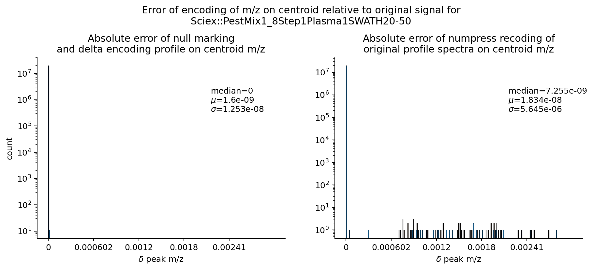

# mzPeak File Format

- [mzPeak File Format](#mzpeak-file-format)
- [Introduction](#introduction)
  - [Overview](#overview)
    - [What _is_ mzPeak?](#what-is-mzpeak)
    - [A brief note about code snippets found in this document.](#a-brief-note-about-code-snippets-found-in-this-document)
  - [Anatomy of a Parquet file](#anatomy-of-a-parquet-file)
    - [The schema](#the-schema)
    - [The metadata key-value pairs](#the-metadata-key-value-pairs)
    - [The columnar data](#the-columnar-data)
- [Container](#container)
    - [ZIP archives](#zip-archives)
      - [Why not TAR?](#why-not-tar)
    - [Unpacked archives](#unpacked-archives)
- [Data Layouts](#data-layouts)
  - [Packed Parallel Metadata Tables](#packed-parallel-metadata-tables)
    - [Controlled Vocabulary Terms](#controlled-vocabulary-terms)
      - [The `parameters` list](#the-parameters-list)
      - [Column Name Inflection](#column-name-inflection)
    - [Null Semantics for Metadata](#null-semantics-for-metadata)
    - [File-Level Metadata](#file-level-metadata)
  - [Signal Data Layouts](#signal-data-layouts)
    - [Arrays and Columns](#arrays-and-columns)
    - [The Array Index](#the-array-index)
      - [Buffer Format](#buffer-format)
      - [Buffer Priority, Naming](#buffer-priority-naming)
    - [Data Arrays, Encoding, Transformations and Parquet](#data-arrays-encoding-transformations-and-parquet)
      - [Zero Run Stripping](#zero-run-stripping)
        - [Null Marking](#null-marking)
          - [Removing Zero Runs](#removing-zero-runs)
          - [Finding Flanking Zero Pairs](#finding-flanking-zero-pairs)
          - [Decoding Null Pairs](#decoding-null-pairs)
        - [Null Semantics for Signal Data](#null-semantics-for-signal-data)
    - [Auxiliary Data Arrays](#auxiliary-data-arrays)
    - [Point Layout](#point-layout)
    - [Chunked Layout](#chunked-layout)
      - [Splitting Data Into Chunks](#splitting-data-into-chunks)
      - [Chunk Encodings](#chunk-encodings)
        - [Basic Encoding](#basic-encoding)
        - [Delta Encoding](#delta-encoding)
        - [Numpress Linear Encoding](#numpress-linear-encoding)
        - [Opaque Array Transforms](#opaque-array-transforms)
  - [Why all these root nodes?](#why-all-these-root-nodes)
- [Index File - `mzpeak_index.json`](#index-file---mzpeak_indexjson)
  - [Data Kind](#data-kind)
  - [Entity Type](#entity-type)
- [Spectrum Signal Data File - `spectra_data.parquet`](#spectrum-signal-data-file---spectra_dataparquet)
  - [Recommendations](#recommendations)
- [Spectrum Metadata File - `spectra_metadata.parquet`](#spectrum-metadata-file---spectra_metadataparquet)
- [Spectrum Peak Data - `spectra_peaks.parquet`](#spectrum-peak-data---spectra_peaksparquet)
- [Chromatogram Signal Data - `chromatograms_data.parquet`](#chromatogram-signal-data---chromatograms_dataparquet)
- [Chromatogram Metadata - `chromatograms_metadata.parquet`](#chromatogram-metadata---chromatograms_metadataparquet)

# Introduction

## Overview

### What _is_ mzPeak?

mzPeak is an archive of multiple [Parquet](https://parquet.apache.org/) files, stored directly in an _uncompressed_ [ZIP](<https://en.wikipedia.org/wiki/ZIP_(file_format)>)
archive or unpacked directory/prefix. Each Parquet file describes a different facet of the stored mass spectrometry run. While the the data model draws on prior
art like mzML (https://peptideatlas.org/tmp/mzML1.1.0.html), it is not a direct re-implementation in a Parquet table. It does attempt
to re-use concepts like controlled vocabularies where feasible as well as arbitrary additional user metadata.

Components of an mzPeak archive:

- `mzpeak_index.json`: Definition of the files present in the archive, encoded as JSON. This makes resolving files by controlled terms easier than matching file names.
- `spectra_metadata.mzpeak`: Spectrum level metadata and file-level metadata. Includes spectrum descriptions, scans, precursors, and selected ions using packed parallel tables.
- `spectra_data.mzpeak`: Spectrum signal data in either profile or centroid mode. May be in point layout or chunked layout which have different size and random access characteristics.
- `spectra_peaks.mzpeak` (optional): Spectrum centroids stored explicitly separately from whatever signal is in `spectra_data.mzpeak`, such as from instrument vendors who store both profile and centroid versions of the same spectra. This file may not always be present.
- `chromatograms_metadata.mzpeak`: Chromatogram-level metadata and file-level metadata. Includes chromatogram descriptions, as well as precursors and selected ions using packed parallel tables.
- `chromatograms_data.mzpeak`: Chromatogram signal data. May be in point layout or chunked layout which have different size and random access characteristics. Intensity measures with different units may be stored in parallel.

### A brief note about code snippets found in this document.

This document describes both a file format and a set of suggested algorithms for preparing data to be stored in that format. The original author (Joshua Klein), includes snippets of Python code to do these operations under the assumption that at this time most technical programmers will know Python, that Python is effectively executable pseudocode, save that the code snippets use three components, abstract base classes from the standard library for type annotations, [NumPy](https://numpy.org/) v2.1 for certain array operations which are assumed to be understandable, and [PyArrow](https://arrow.apache.org/docs/python/index.html) v20.0 for operations on Apache Arrow arrays which are conceptually equivalent for in-memory representations of the data stored in Parquet files.

## Anatomy of a Parquet file

This is a minimal overview of Parquet. For more details, please see <https://parquet.apache.org/> for further explanation.

### The schema

Parquet files contain a physical data schema defining how their data columns are encoded in bytes on disk. This schema supports arbitrary levels of nullability, nesting (groups) or repetition (lists). These physical data types may also be mapped to one or more "logical types".

There is a broader many-to-many mapping between Parquet schemas and [Apache Arrow](https://arrow.apache.org/) schemas. Arrow supports many types that Parquet does not, but they share a common abstraction of columnar data storage with a notion of per-value nullability, and while they store these concepts differently, it is straight-forwards to convert from one to the other.

### The metadata key-value pairs


At the end of a Parquet file is a footer containing user-defined metadata along with the file's schema, offsets and search indices. This user-defined metadata is stored in key-value pairs, which makes it amenable to serializing light-weight, immediately interesting metadata there that do not make sense to force into the data columns.

### The columnar data

Parquet is a strongly typed binary columnar data format with layered blocked compression that permits random access.

TODO: write more here

# Container

### ZIP archives

In order to pack multiple Parquet tables together under a single file name on disk, we need a container file format. To that end we use the [ZIP](https://www.iana.org/assignments/media-types/application/zip) archive to bundle multiple files together. ZIP files start with a header containing the magic bytes followed by a sequence of blocks of (header, file) pairs, terminating with a central directory listing how to find each file in the archive. Files saved in a ZIP may be stored compressed or uncompressed. When mzPeak is stored in a ZIP it **MUST** store its member files uncompressed.

#### Why not TAR?

TAR archives are designed for a linear traversal. In order to know all of the files in the archive, you must jump from header entry to header entry until you reach the end of the archive. Compared to ZIP's central directory index, this is less efficient and more expensive for object stores. TAR does not support per file encryption either, making protecting parts of the archive that are _not_ in Parquet more difficult.

### Unpacked archives

If an mzPeak archive is stored in an unpacked directory, the directory name is treated as the name of the name of the run file.

# Data Layouts

## Packed Parallel Metadata Tables

The `spectra_metadata.mzpeak` and `chromatograms_metadata.mzpeak` store multiple schemas in parallel. In these Parquet files, the root schema is made up of several branched "group" or "struct" (Parquet vs. Arrow nomenclature) that may be null at any level. We use relational database language, specifically, "primary key" and "foreign key" to describe the interconnections between the different tables that are packed together here.

Here is a stripped down example where two rows of related MS1 and MS2 spectra. Treat `scan.source_index`, `precursor.source_index`, `precursor.precursor_index`, `selected_ion.source_index`, and `selected_ion.precursor_index` as a foreign key with respect to `spectrum.index`, a primary key. `precursor.source_index` refers to the `spectrum` which this `precursor` record belongs to and `precursor.precursor_index` refers to the `spectrum` that is that _is_ the precursor of the `spectrum` referenced by `precursor.source_index`, and (`precursor.source_index`, `precursor.precursor_index`) forms a compound primary key. Any of these columns may be `null` which means that such a record does not exist in the table. This also applies to the `selected_ion` facet.

<style style="display: none;">
  .packed-table thead tr th {
    font-size: 0.7em;
    padding: 0.6em;
    text-align: center;
  }
  .packed-table tbody tr td {
    font-size: 0.7em;
    padding: 0.2em
  }
</style>

<table class="packed-table" style="font-size=0.2em">
  <thead>
    <tr>
      <th colspan=4>spectrum</th>
      <th colspan=2>scan</th>
      <th colspan=3>precursor</th>
      <th colspan=3>selected_ion</th>
    </tr>
    <tr>
      <th>
      index
      </th>
      <th>
      id
      </th>
      <th>
      time
      </th>
      <th>
      MS_1000511_<br/>ms_level
      </th>
      <th>
      source_<br/>index
      </th>
      <th>
      MS_1000616_preset_<br/>scan_configuration
      </th>
      <th>
      source_<br/>index
      </th>
      <th>
      precursor_<br/>index
      </th>
      <th>
      isolation_<br/>window
      </th>
      <th>
      source_<br/>index
      </th>
      <th>
      precursor_<br/>index
      </th>
      <th>
      MS_1000744_selected_<br/>ion_mz
      </th>
    </tr>
  </thead>
  <tbody>
    <tr>
      <td colspan=12 style="text-align:center;">...</td>
    </tr>
    <tr>
      <td>502</td>
      <td>scan=502</td>
      <td>20.51</td>
      <td>1</td>
      <td>502</td>
      <td>3</td>
      <td>503</td>
      <td>502</td>
      <td>{...}</td>
      <td>503</td>
      <td>502</td>
      <td>233.5</td>
    </tr>
    <tr>
      <td>503</td>
      <td>scan=503</td>
      <td>20.531</td>
      <td>2</td>
      <td>503</td>
      <td>2</td>
      <td>504</td>
      <td>502</td>
      <td>{...}</td>
      <td>504</td>
      <td>502</td>
      <td>562.3</td>
    </tr>
    <tr>
      <td colspan=12 style="text-align:center;">...</td>
    </tr>
  </tbody>
</table>

### Controlled Vocabulary Terms

Like mzML before it, mzPeak makes heavy use of controlled vocabularies for representing rich metadata. mzPeak uses controlled vocabulary terms in several ways:

1. As columns. When a term is used as a column name, that column's values are either the defined value of an expected type for the term (e.g. the term `has_value_type`) _OR_ the a CURIE for a child of the column name. For example
   1. The column [`MS_1000525_spectrum_representation`](http://purl.obolibrary.org/obo/MS_1000525) would have values that are CURIEs for a child term, `MS:1000127` "centroid spectrum" or `MS:1000128` "profile spectrum", as appropriate for the spectrum the row is describing.
   2. The column [`MS_1000511_ms_level`](http://purl.obolibrary.org/obo/MS_1000511) would hold an integer value, as appropriate for the spectrum the row is describing.
2. As structural elements. In several places in the format, like the [array index](#the-array-index), we use CURIEs to reference named concepts that explain the semantics of the data structure without changing the shape of the data structure.
3. As pluggable metadata carriers in `parameters` arrays, akin to `<cvParam />` in mzML. For every schema facet of a metadata table, a `parameters` column is allowed. See the [parameters list](#the-parameters-list) for details on

#### The `parameters` list

The `parameters` column may be present in any facet of a metadata table. It _MUST_ be a list of the following schema:
```python
optional group field_id=-1 parameters (List) {
  repeated group field_id=-1 list {
    optional group field_id=-1 item {
      optional group field_id=-1 value {
        optional int64 field_id=-1 integer;
        optional double field_id=-1 float;
        optional binary field_id=-1 string (String);
        optional boolean field_id=-1 boolean;
      }
      optional binary field_id=-1 accession (String);
      optional binary field_id=-1 name (String);
      optional binary field_id=-1 unit (String);
    }
  }
}
```

The `parameters.list.item.value` group must have a column for each data type so a parameter can take on one of these value types. Unused type slots _MUST_ be `null`. (QUESTION: Should this support lists/maps?). `parameters` entries _MAY_ have unit defined by a controlled vocabulary term CURIE stored in the `parameters.list.item.unit` column. As in mzML's `<userParam />`, uncontrolled parameters may also be included in the `parameters` list by simply storing a parameter _WITHOUT_ a value in the `parameters.list.item.accession` column.

__NOTE:__ Writers are encouraged to, when sufficient context is available, encode parameters that are present in most rows of a table as columns. This more space efficient and opens the door to easy predicate filtering.

#### Column Name Inflection

When representing a controlled vocabulary term concept as a column in the table, the column name _SHOULD_ use the following inflection rules to construct the column name:

1. The base column name is `${CV_CODE}_${CV_ACCESSION}_${CLEANED_NAME}` where:
   1. `${CV_CODE}` is the identifier for the controlled vocabulary itself, `MS` for PSI-MS or `UO` for the unit ontology.
   2. `${CV_ACCESSION}` is the accession number. `MS:1000016` for "scan start time" would be `1000016`.
   3. `${CLEANED_NAME}` is the term's name with any non-Parquet column compatible characters replaced with `_`. The regular expression `/[^a-zA-Z0-9_\\\\-]+/` is sufficient to match all of these characters in ASCII. For `MS:1000016` for "scan start time", this would be `MS_1000016_scan_start_time`
   4. The string "m/z" appears so frequently it _SHOULD_ be rewritten `mz` to avoid unnecessary additional underscores. For `MS:1000504` for "base peak m/z", this would be written `MS_1000504_base_peak_mz`.
2. _IF_ there is a single unit kind specified for all values in the column it _SHOULD_ be specified by appending `_unit_${UNIT_CV_CODE}_${UNIT_CV_ACCESSION}` to the inflected name. `MS_1000528_lowest_observed_mz_unit_MS_1000040` would correspond to `MS:1000528` "lowest observed m/z" with a unit of `MS:1000040` "m/z".
3. _IF_ the unit for this column varies it _SHOULD_ be specified as a separate column with `_unit` appended to the column name whose value is the unit's CURIE.

### Null Semantics for Metadata

A row value that is `null` should be treated as being absent, having no value. If a foreign key column is `null`, assume the entry does not exist in the table, as in the case where an MS2 spectrum is stored without MS1 spectra as in MGF files, or a slice of an MS run. If it is the primary key of the table, the reader _SHOULD_ skip of the columns in that row for that table.

A writer implementation is _SHOULD_ to minimize the number of interspersed rows that are `null`, but this is not strictly required. Minimizing the interspersed nulls improves compressability. See the images below, the "Packed Tables" has all of the rows of each parallel table contiguous, while the "Sparse Tables" diagram shows rows of nulls intermixed

 

### File-Level Metadata

Some metadata is descriptive of the entire run and does not make sense to store in the rows of a table. This data is stored as JSON in the [Parquet key-value metadata](#the-metadata-key-value-pairs) of the `metadata` [data kind](#data-kind) files.

## Signal Data Layouts

### Arrays and Columns

It is common in mass spectrometry to talk about a spectrum _having_ an m/z array as synonymous with having been measured in the m/z dimension, and those m/z values are represented using some kind of physical data type in memory, likewise having an intensity array corresponding to the abundance of the signal parallel to the m/z array. In mzML, it is possible to use different physical data types for these two dimensions on different spectra in the same file, and there may well be legitimate use-cases for that. mzPeak can store array data in two ways. One way to store the arrays as columns in a signal data layout, burning the column into the schema and added to the `array index`. Another way is to store it as an `auxiliary array` which will be stored in the associated metadata table's `*.auxiliary_arrays` value for that entity's row. Auxiliary data arrays can be individually configured by the writer, have custom compression or data type decoding or cvParams, but it cannot be searched or sliced (read a segment of) without decoding the entire array, just as in mzML. By contrast, any array that is written as a column is encoded directly in Parquet, is part of the schema, and subject to its adaptive encoding process and compression. Currently, we assume that the first sorted array is the axis around which all other values are arranged, sorting rank 0, and any arrays that are shorter or longer _SHOULD_ instead be stored in `auxiliary_arrays` as well.

### The Array Index

In order to properly annotate what kind of array a column _is_, we include a JSON-serialized `array index` in the [Parquet key-value metadata](#the-metadata-key-value-pairs), an list of data structures that describe each array in controlled vocabulary. A column is part of the Parquet file's schema and must always exist and have a homogenous type of value or a be marked `null` for each row.

```json
{
  "prefix": "point",
  "entries": [
    {
      "context": "spectrum", // This is an array describing a spectrum
      "path": "point.mz", // The path to the column for this array in the Parquet schema
      "data_type": "MS:1000523", // The controlled vocabulary term  for the data type of this array
      "array_type": "MS:1000514", // The controlled vocabulary term for the array itself
      "array_name": "m/z array", // A human readable name and a place to store a custom name through `non-standard array`
      "unit": "MS:1000040", // The values in this array have the unit m/z
      "buffer_format": "point", // This column uses the point layout
      "transform": null, // No transformation was applied to this data
      "data_processing_id": null, // No specific data processing pipeline was applied, use the default data processing method
      "buffer_priority": "primary", // This is the primary m/z array, default all queries to read this column when looking for m/z values
      "sorting_rank": 0 // This array's column is assumed to be sorted within entries, with all other arrays' columns sorted afterwards
    },
    {
      "context": "spectrum",
      "path": "point.intensity",
      "data_type": "MS:1000521",
      "array_type": "MS:1000515",
      "array_name": "intensity array",
      "unit": "MS:1000131", // The unit of this array is detector counts
      "buffer_format": "point",
      "transform": null,
      "data_processing_id": null,
      "buffer_priority": "primary",
      "sorting_rank": null // This array does not impose any sorting order on the data
    }
  ]
}
```

This array index describes the table shown below for the [`point layout`](#example-point-table)

Governed by `schema/array_index.json`.

#### Buffer Format

TODO: Describe the buffer format list.

#### Buffer Priority, Naming

In Parquet, all column names and types need to be known before you can begin writing, and no two columns can have the same name + path. Normally, we have a coordinate array column (e.g. m/z or time) and an intensity array column. If you have intensity arrays with different units or different data types, they would need to be defined as separate arrays in the [array index](#the-array-index) and thus have distinct names. While this case may be uncommon for spectra, when working with diagnostic traces stored as chromatograms this can be unavoidable. For ergonomics, we want to use simple column names most of the time, and it would be ideal if the most common columns had consistent names as this makes using files from raw Parquet tools easier. To that end, the most common (as defined by the implementation) version of each array type _SHOULD_ have a `buffer_priority` property of `"primary"` and receive a short and consistent name. The [table](#array-name-recommendations) below lists recommended short names:

<figure id="array-name-recommendations">

| accession  | name                                            | column name                               |
| :--------- | :---------------------------------------------- | :---------------------------------------- |
| MS:1000514 | m/z array                                       | mz                                        |
| MS:1000515 | intensity array                                 | intensity                                 |
| MS:1000516 | charge array                                    | charge                                    |
| MS:1000517 | signal to noise array                           | signal_to_noise                           |
| MS:1000595 | time array                                      | time                                      |
| MS:1000617 | wavelength array                                | wavelength                                |
| MS:1002530 | baseline array                                  | baseline                                  |
| MS:1002529 | resolution array                                | resolution                                |
| MS:1002893 | ion mobility array                              | ion_mobility                              |
| MS:1003007 | raw ion mobility array                          | raw_ion_mobility                          |
| MS:1002816 | mean ion mobility array                         | mean_ion_mobility                         |
| MS:1003154 | deconvoluted ion mobility array                 | deconvoluted_ion_mobility                 |
| MS:1003008 | raw inverse reduced ion mobility array          | raw_inverse_reduced_ion_mobility          |
| MS:1003006 | mean inverse reduced ion mobility array         | mean_inverse_reduced_ion_mobility         |
| MS:1003155 | deconvoluted inverse reduced ion mobility array | deconvoluted_inverse_reduced_ion_mobility |
| MS:1003153 | raw ion mobility drift time array               | raw_drift_time                            |
| MS:1002477 | mean ion mobility drift time array              | mean_drift_time                           |
| MS:1003156 | deconvoluted ion mobility drift time array      | deconvoluted_ion_mobility_drift_time      |

<figcaption>
  Array name recommendations
</figcaption>
</figure>

### Data Arrays, Encoding, Transformations and Parquet

Parquet can write [page indices](https://parquet.apache.org/docs/file-format/pageindex/) on any column that is a _leaf_ node in the schema based upon the value being stored prior to applying [encoding](https://parquet.apache.org/docs/file-format/data-pages/encodings/) and [compression](https://parquet.apache.org/docs/file-format/data-pages/compression/). To that effect, we must take care when trying to store data cleverly. The following section may refer to spectra, but these are applicable more broadly.

#### Zero Run Stripping

When storing spectrum data, some vendors will produce arrays with lots of "empty" regions filled with zero intensity values along a semi-regularly spaced m/z axis. These regions hold little information, so all but the first and last zero intensity points are removed. This is only meaningful for profile data. Readers SHOULD assume that zero runs have been stripped.

##### Null Marking

For spectra with many small gaps, even zero run stripping leaves too much unhelpful information in the data. We can instead replace the flanking zero intensity points with `null` m/z and intensity values and Parquet will skip storing the expensive 32- and/or 64-bit values, retaining only the validity buffer bit flag. We can separately fit a simple m/z spacing model using weighted least squares of the form:

$$
    \delta mz \sim β_0 + β_1 mz + β_2 mz^2 + ϵ
$$

or using the following Python code:

<details>
<summary>Python code for fitting the weighted least squares model</summary>

```python
class DeltaCurveRegressionModel:
    beta: np.ndarray

    def __init__(self, beta: np.ndarray):
        self.beta = beta

    @classmethod
    def fit(
        cls,
        mz_array,
        delta_array,
        weights: np.ndarray | None = None,
        threshold: float | None = None,
        rank: int = 2,
    ):
        if weights is None:
            weights = np.ones(len(mz_array))
        else:
            weights = weights

        if threshold is None:
            threshold = 1.0

        # Drop all entries where the gap between m/z values > threshold
        raw = mz_array[1:][delta_array <= threshold]
        w = weights[1:][delta_array <= threshold]
        y = delta_array[delta_array <= threshold]

        # Build the design matrix
        data = [data.append(np.ones_like(raw))]
        for i in range(1, rank + 1):
            data.append(raw**i)
        data = np.stack(data, axis=-1)

        # Use the QR decomposition to solve the weighted least squares problem
        # to estimate weights predicting δ m/z.
        # https://stats.stackexchange.com/a/490782/59613
        chol_w = np.sqrt(w)
        qr = np.linalg.qr(chol_w[:, None] * data)
        v = qr.Q.T.dot(chol_w * y)
        beta = solve_triangular(qr.R, v)

        # Numerically equivalent to and more stable than the direct inversion
        # beta = np.linalg.inv((data.T * w).dot(data)).dot(data.T * w).dot(y)
        return cls(beta)

    def predict(self, mz: float) -> float:
        acc = self.beta[0]
        for i in range(1, len(self.beta)):
            acc += self.beta[i] * mz ** i
        return acc
```

</details>

Then when reading the the null-marked data, use either the local 2nd median $δ mz$ or the learned model for that spectrum to compute the m/z spacing for singleton points to achieve a very accurate reconstruction. Because the non-zero m/z points remain unchanged, the reconstructed signal's peak apex or centroid should be unaffected. If the peak is composed of only three points including the two zero intensity spots, no meaningful peak model can be fit in any case so the miniscule angle change this would induce are still effectively lossless.




Keep in mind that all Numpress compression methods are still available and still provide superior size reduction, but carry this slightly larger loss of accuracy. Using a Numpress compression is a transformation that requires the [Chunked Layout](#chunked-layout).

###### Removing Zero Runs

A zero run is defined explicitly as a sequence of 3 or more zero values that should be reduced to just the first and last positions in the run. Zero runs can be very long and outside of certain scenarios which assume a complete grid of coordinate values, provide no value. If zero runs need to be reconstructed beyond the flanking points left at the end of these runs, the same method used to fill in `null`s here can be used to extend zero runs.

<details>
<summary>Python code for finding zero runs</summary>

```python
def find_where_not_zero_run(data: Sequence[Number]) -> Sequence[int]:
    """
    Construct a list of positions that are not part of a zero run.

    A zero run is any position *i* such that:
      1. ``x[i] == 0``
      2. ``(i == 0) or (x[i - 1] == 0)``
      3.``(i == (len(x) - 1)) or (x[i + 1] == 0)``

    We build a position list here because we need to extract these positions
    from ALL dimension arrays for this entity, not just the current array.

    Parameters
    ----------
    data : :class:`Sequence` of :class:`Number`
        The numerical data to traverse

    Returns
    -------
    :class:`np.ndarray` of :class:`np.uintp`
    """
    n = len(data)
    n1 = n - 1

    was_zero = False

    acc = []
    i = 0
    while i < n:
        v = data[i]
        if v is not None:
            if v == 0:
                if (was_zero or (len(acc) == 0)) and (
                    (i < n1 and data[i + 1] == 0) or i == n1
                ):
                    pass
                else:
                    acc.append(i)
                was_zero = True
            else:
                acc.append(i)
                was_zero = False
        else:
            acc.append(i)
            was_zero = False
        i += 1
    return np.array(acc, dtype=np.uintp)
```

</details>

###### Finding Flanking Zero Pairs

Zero intensity points on the sides of peaks still use non-trivial amounts of storage in sparse datasets. This step does _not_ match all zero intensity points, only those that occur on the flanks of profile peaks. Once these indices are found, they can be used to construct the `null` mask or "validity bitmap" of an Arrow array which is equivalent to how a Parquet column chunk would be constructed.

<details>
<summary>Python code for finding flanking zeros</summary>

```python
def is_zero_pair_mask(data: Sequence[Number]) -> "np.typing.NDArray[np.bool_]":
    '''
    Create a boolean mask for positions that are composed of two zeroes in a row.

    Parameters
    ----------
    data : :class:`Sequence` of :class:`Number`
        The numerical data to traverse

    Returns
    -------
    :class:`np.ndarray` of :class:`bool`
    '''
    n = len(data)
    n1 = n - 1
    was_zero = False
    acc = []
    for i, v in enumerate(data):
        if v == 0:
            if was_zero or (i < n1 and data[i + 1] == 0):
                acc.append(True)
            else:
                acc.append(False)
            was_zero = True
        else:
            acc.append(False)
            was_zero = False
    return np.array(acc)
```

</details>

###### Decoding Null Pairs

Decoding null pairs, the process of undoing [`null marking`](#null-marking) involves finding regions bounded between two `null`s, or the start of the array and a `null`, or a `null` and the end of the array, then filling the null values with either a locally estimated value when you have more than one value to estimate the median delta from, or to use the regression model described ealier to impute the value for a single point. Unpaired `null` values _MAY_ only be found as the first or last `null` in the array, any other unpaired `null`s are unrecoverable errors. A run of three or more `null` values is encountered, it _MAY_ be recoverable but should not occur under normal operation.

The locally estimated value _SHOULD_ be the second median of the spacing of the current segment's non-`null` values. The regression model is used to predict the spacing from the non-null value within a segment with only one non-null value.

<details>
<summary>Python code for filling <em>null</em> marked values</summary>

```python

def find_pairs(mask: Sequence[bool]) -> Sequence[int]:
    """
    Construct index ranges between pairs of :const:`True` values in
    ``mask``.

    The first and last index range will include the beginning and ending
    of the array respectively, even if the mask does not start/end with a
    :const:`True` value.

    The resulting array will have two columns, the start and end indices
    of the spans between two :const:`True` values (or the termini of the array).

    .. warning::
      This function *can* fail or produce incorrect output if there are runs of
      :const:`True` values longer than 2 in the ``mask``

    Parameters
    ----------
    mask : :class:`Sequence` of :class:`bool`

    Returns
    -------
    np.typing.NDarray[int]
    """
    parts = []
    indices = np.where(mask)[0]
    if len(indices) == 0:
        return np.array([[0, len(mask)]])
    if indices[0] != 0:
        parts.append([0])
    parts.append(indices)
    if indices[-1] != len(mask) - 1:
        parts.append([len(mask) - 1])
    indices = np.concat(parts)
    indices = indices.reshape((-1, 2))
    indices[:, 1] += 1
    return indices


def estimate_median_delta(data: Sequence[Number]) -> tuple[Number, np.typing.NDArray]:
    """
    Find the 2nd median of ``np.diff(data)``.

    This is a relatively crude spacing estimate for continuous profile data.

    Returns
    -------
    :class:`Number`
        The 2nd median of ``np.diff(data)``
    :class:`np.ndarray`
        The values from which the previous return values were estimated
    """
    deltas = np.diff(data)
    median = np.median(deltas)
    deltas_below = deltas[deltas <= median]
    median = np.median(deltas_below)
    return median, deltas_below


def fill_nulls(
    data: pa.Array, common_delta: DeltaModelBase
) -> "np.typing.NDArray":
    """
    Fill ``null`` values in ``data`` using the ``common_delta`` model or the locally estimated
    median delta if sufficient data are available.

    Parameters
    ----------
    data : :class:`pyarrow.Array`
        The data array to fill nulls in with ``common_delta``
    common_delta : :class:`DeltaModelBase` or :class:`Number`
        The common spacing model, either specified as a model instance or as a single constant spacing term.

    Returns
    -------
    np.ndarray
    """
    if not isinstance(common_delta, DeltaModelBase):
        if isinstance(common_delta, Number):
            common_delta = ConstantDeltaModel(common_delta)
        else:
            common_delta = DeltaCurveRegressionModel(np.asarray(common_delta))

    pair_indices = find_pairs(data.is_null())

    chunks = []
    for (start, end) in pair_indices:
        # Get the values in the array between start and end
        chunk = np.asarray(data.slice(start, end - start))
        n = len(chunk)
        # The set of values that are not null
        has_real = chunk[~np.isnan(chunk)]
        n_has_real = len(has_real)
        if n_has_real == 1:
            # If there is only one non-null value, this is a singleton
            # point, but it might only have one or two sides to pad
            if n == 2:
                if np.isnan(chunk[0]):
                    chunk[0] = chunk[1] - common_delta(chunk[1])
                else:
                    chunk[1] = chunk[0] + common_delta(chunk[0])
            elif n == 3:
                dx = common_delta(chunk[1])
                chunk[0] = chunk[1] - dx
                chunk[2] = chunk[1] + dx
            else:
                raise Exception()
        else:
            # Otherwise this is a run of values, so we can estimate a more accurate
            # delta directly from the data
            dx, _ = estimate_median_delta(has_real)
            if np.isnan(chunk[0]):
                chunk[0] = chunk[1] - dx
            if np.isnan(chunk[-1]):
                chunk[-1] = chunk[-2] + dx
        chunks.append(chunk)
    return np.concat(chunks)
```

</details>

##### Null Semantics for Signal Data

Unless otherwise noted, readers _SHOULD_ treat `null` values in the sorting rank 0 array of the entry as governed by this model with parallel `null` values in any intensity arrays as 0. The former should have a `transformation` value of [`MS:1003901`]() and the latter should have a `transformation` value [`MS:1003902`](). All other values for those points should be read as-is with null semantics meaning that the value was absent. Writers using null marking _SHOULD_ only use `null` for the first sorting dimension and associated intensity value, all other columns should be written as-is.

### Auxiliary Data Arrays

When an array is present in an entry, but is not encoded as a column in the schema, it must be stored as an auxiliary array. This can happen when mixing different kinds of detectors in a single collection, or especially with diagnostic traces where every array might have different dimensions along a shared time axis or subsampled arrays. Auxiliary data arrays have a schema similar to [`binaryDataArray`](https://peptideatlas.org/tmp/mzML1.1.0.html#binaryDataArray) in mzML, encoded in Parquet. They are described in JSON schema at [schema/auxiliary_array.json](https://raw.githubusercontent.com/mobiusklein/mzpeak_prototyping/refs/heads/main/schema/auxiliary_array.json)

```
optional group auxiliary_arrays (List) {
  repeated group list {
    optional group item {
      optional group data (List) {
        repeated group list {
          required int32 item (Int(bitWidth=8, isSigned=false));
        }
      }
      optional group name {
        optional group value {
          optional int64 integer;
          optional double float;
          optional binary string (String);
          optional boolean boolean;
        }
        optional binary accession (String);
        optional binary name (String);
        optional binary unit (String);
      }
      optional binary data_type (String);
      optional binary compression (String);
      optional binary unit (String);
      optional group parameters (List) {
        repeated group list {
          optional group item {
            optional group value {
              optional int64 integer;
              optional double float;
              optional binary string (String);
              optional boolean boolean;
            }
            optional binary accession (String);
            optional binary name (String);
            optional binary unit (String);
          }
        }
      }
      optional binary data_processing_ref (String);
    }
  }
}
```

### Point Layout

When storing data arrays, the point layout stores the data as-is in parallel arrays alongside a repeated index column. The top-level node is named `point` and it is a group with an arbitrary number of columns. The entity index column _MUST_ be the first column under `point`.


<style style="display: none">
  .point-table {
    text-align: center;
  }

  .point-table thead th {
    text-align: center;
  }
</style>
<table id="example-point-table" class="point-table">
  <thead>
    <tr>
      <th colspan=3>point</th>
    </tr>
    <tr>
      <th>spectrum_index</th>
      <th>mz</th>
      <th>intensity</th>
    </tr>
  </thead>
  <tbody>
    <tr><td>1</td> <td>213.2</td><td>1002</td></tr>
    <tr><td>1 </td> <td>506.9</td><td>500</td> </tr>
    <tr><td>1 </td>  <td>758</td><td>405</td> </tr>
    <tr><td>...</td> <td>...</td><td>...</td> </tr>
    <tr><td>2 </td><td>329.1</td><td>50</td> </tr>
    <tr><td>2 </td><td>516.5</td><td>5002</td> </tr>
    <tr><td>2 </td><td>783.8</td><td>302</td> </tr>
  </tbody>
</table>

This layout is simple, but carries several advantages. Scalar columns are easily filtered along the page-level range index. This makes multi-dimensional queries easier to write and optimize. The arrays are transparently encoded and compressed by Parquet, so the data may still be stored compactly. The data must be stored as-is in order to use the page index so no additional obscuring transformations can be used.

<!-- The [zero run stripping](#zero-run-stripping) and [null marking](#null-marking) methods may still be employed as they only remove non-meaningful points from the array. -->

### Chunked Layout

When storing data arrays, the chunked layout treats one array, which must be sorted, as the "main" axis, cutting the array into chunks of a fixed size along that coordinate space (e.g. steps of 50 m/z) and taking the same segments from parallel arrays. The main axis chunks' start, end, and a repeated index are recorded as columns, and then each array may be encoded as-is or with an opaque transform (e.g. delta-encoding, Numpress). The start and end interval permits granular random access along the main axis as well as the source index. The top-level node is named `chunk` and it has a layout as shown below. The entity index column _MUST_ be the first column under `chunk`.


<style>
  .chunk-table {
    text-align: center;
  }

  .chunk-table thead th {
    text-align: center;
  }
</style>
<table class="chunk-table">
<thead>
  <tr>
    <th colspan=6>chunk</th>
  </tr>
  <tr><th>spectrum_index</td><th>mz_start</td><th>mz_end</td><th>mz_chunk values</td><th>chunk_encoding</td><th>intensity</td></tr>
</thead>
<tbody>
<tr><td>1</td><td>200</td><td>250</td><td>[0.0013, ..., 0.0013]</td><td>MS:1003089</td><td>[...]</td></tr>
<tr><td>1</td><td>250</td><td>300</td><td>[0.0014, ..., 0.0014]</td><td>MS:1003089</td><td>[...]</td></tr>
<tr><td>1</td><td>500</td><td>550</td><td>[0.0014, ..., 0.0015]</td><td>MS:1003089</td><td>[...]</td></tr>
<tr><td>...</td><td>...</td><td>...</td><td>...</td><td>...</td><td>...</td></tr>
<tr><td>2</td><td>200</td><td>250</td><td>[0.0013, ..., 0.0013]</td><td>MS:1003089</td><td>[...]</td></tr>
<tr><td>2</td><td>350</td><td>400</td><td>[0.0014, ..., 0.0014]</td><td>MS:1003089</td><td>[...]</td></tr>
<tr><td>2</td><td>400</td><td>450</td><td>[0.0013, ..., 0.0014]</td><td>MS:1003089</td><td>[...]</td></tr>
</tbody>
</table>

This example uses a delta-encoding for the m/z array chunks' values, which can be efficiently reconstructed with very high precision for 64-bit floats. The m/z values within the `mz_chunk_values` list aren't accessible to the page index, but the `_start` and `_end` columns are. The chunk values are still subject to Parquet encodings so they can be byte shuffled as well which further improves compression.

The chunked layout's column naming rules:

1. `<entity>_index` (integer): The index key for the entity this chunk belongs to.
2. `<array_name>_start` (float64): The first coordinate value in this chunk, where it _starts_ at inclusively.
3. `<array_name>_end` (float64): The last coordinate value in this chunk, where it _ends_ at inclusively.
4. `<array_name>_chunk_values` (list): The encoded coordinates from `array_name` according to the `chunk_encoding` column.
5. `chunk_encoding` (CURIE): The method by which `<array_name>_chunk_values` were encoded. See [Chunk Encodings](#chunk-encodings) for more details.

All other columns are expected to be `list` arrays whose names are simply their `array_name` as described in the index, or surrogate arrays not named in the array index that hold additional encoded bytes.

#### Splitting Data Into Chunks

The process for constructing a chunk table for a signal entry may break in any pattern so long as the chunks are non-overlapping and ascending. The chunking procedure needs to be `null`-aware, particularly aware of `null` pairs used to denote masked regions. An algorithm for producing equal width chunks is given below. The granularity of the chunking is configurable, trading off random access granularity vs. compression efficiency.

<details>

<summary>Python code for partitioning chunks of up to width <span style="font: italic 1em serif;">k</span> with null pairs present</summary>

```python
import pyarrow as pa

def null_chunk_every(data: pa.Array, width: float) -> list[tuple[int, int]]:
    """
    Partition a sorted numerical array into segments spanning `width` units.

    This operation is null-aware, so sparse arrays can be partitioned.

    Parameter
    ---------
    data : pa.Array
        The data to be partitioned
    width : float
        The spacing (in units along the data dimension) between chunks

    Returns
    -------
    list[tuple[int, int]]
        The start and end index of each chunk
    """
    start = None
    n = len(data)
    i = 0
    # Find the first non-null position
    while i < n:
        v = data[i]
        if v.is_valid:
            start = v.as_py()
            break
        else:
            i += 1

    # If we never found a non-null position, just return a single chunk
    if start is None:
        return [(0, n)]

    chunks = []
    offset = 0
    threshold = start + width
    i = 0
    while i < n:
        v = data[i]
        if v.is_valid:
            v = v.as_py()
            if v > threshold:
                if ((i + 1) < n) and (not data[i + 1].is_valid):
                    while ((i + 1) < n) and (not data[i + 1].is_valid):
                        i += 1
                # We don't want to create a chunk of length 1, especially not if it is a null
                # point. If not, we have to relax the width requirement.
                if i - offset > 1:
                    chunks.append((offset, i))
                    offset = i
                # Update the threshold. We might need to update multiple times if the next value
                # is far away.
                while threshold < v:
                    threshold += width
        # Look ahead and see if the next value is not null since this one is.
        elif ((i + 1) < n) and (data[i + 1].is_valid):
            i += 1
            v = data[i].as_py()
            if v > threshold:
                i -= 1
                chunks.append((offset, i))
                offset = i
                # Update the threshold. We might need to update multiple times if the next value
                # is far away.
                while threshold < v:
                    threshold += width
        i += 1
    if offset != n:
        chunks.append((offset, n))
    return chunks
```

</details>

#### Chunk Encodings

##### Basic Encoding

Chunk Encoding Controlled Vocabulary: [`MS:1000576|no compression`](http://purl.obolibrary.org/obo/MS_1000576)

When storing centroids or data that are not similarly spaced as is usually the case for pre-centroided spectra, but still want to use the chunked layout, no special encoding of the chunked values is necessary. The values within each chunk are written as-is to the chunk values array. This doesn't improve compressibility but it maintains a consistent schema for other entries that would benefit from a different encoding.

__Note__: The start point is _excluded_ from the chunk values array.

##### Delta Encoding

Chunk Encoding Controlled Vocabulary: [`MS:1003089|truncation, delta prediction and zlib compression`](http://purl.obolibrary.org/obo/MS_1003089)

When working with data that is laid out on a locally (*almost*) uniform grid using 64-bit floats, it is possible to improve compression by computing a delta encoding of the coordinates.

__Note__: The start point is _excluded_ from the chunk values array.

<details>

<summary>Python code for delta encode/decode with null awareness</summary>

```python
import pyarrow as pa

def null_delta_encode(data: pa.Array) -> pa.Array:
    """
    Delta-encode an Arrow array containing nulls. Nulls are encoded as null values, and treated as 0.0
    for the purposes of computing the next delta.

    Parameters
    ----------
    data : pa.Array
        The data to delta encode

    Returns
    -------
    pa.Array
    """
    acc = []
    it = iter(data)
    # Get the first entry in the array. It will be the first point of reference but not part
    # of the delta sequence unless it is `null`
    last = next(it)
    if not last.is_valid:
        acc.append(last)

    for item in it:
        # If the value isn't `null`,
        if item.is_valid:
            val = item.as_py()
            # Compute a delta relative to the last item if it was not `null`
            if last.is_valid:
                acc.append(pa.scalar(val - last.as_py()))
            # otherwise treat the last value as 0.0, the additive identity
            else:
                acc.append(item)
            # Update last item
            last = item
        else:
            # Append the `null` unmodified and update the last item.
            acc.append(item)
            last = item
    return pa.array(acc)


def null_delta_decode(data: pa.Array, start: pa.Scalar) -> pa.Array:
    """
    Decode an Arrow array that was delta-encoded *with* nulls.

    This is necessarily a copying operation.

    Parameters
    ----------
    data : pa.Array
        The data to be decoded.
    start : pa.Scalar
        The starting value, an offset

    Returns
    -------
    pa.Array
    """
    acc = []
    # If the first value is `null`,
    if not data[0].is_valid:
        # and the second value is `null`,
        if not data[1].is_valid:
            # then append the `start` value, we started at a non-null value immediately followed by a null pair.
            acc.append(start)
        start = pa.scalar(None, data.type)
    else:
        # otherwise use the starting point
        acc.append(start.as_py())
    last = start
    for item in data:
        # if the current point is valid
        if item.is_valid:
            val = item.as_py()
            # and the last is valid
            if last.is_valid:
                # reconstitute the delta encoded value at this position
                last = pa.scalar(val + last.as_py())
                acc.append(last)
            else:
                # otherwise the last value is assumed to be zero so it does
                # not need to be adjusted
                acc.append(item)
                last = item
        else:
            # otherwise this position is null and we carry it forward as such
            acc.append(item)
            last = item
    return pa.array(acc)
```

</details>

##### Numpress Linear Encoding

Chunk Encoding Controlled Vocabulary: [`MS:1002312|MS-Numpress linear prediction compression`](http://purl.obolibrary.org/obo/MS_1002312)

This uses the Numpress linear prediction method ([10.1074/mcp.O114.037879](https://www.mcponline.org/article/S1535-9476(20)33083-8/fulltext)) to compress the chunk's values as raw bytes. Numpress creates a buffer containing an 8 byte fixed point, 4 byte value 0, 4 byte value 1, followed by 2 byte residuals for all subsequent values in the array. This means that the array is by definition not alignable to a 4- or 8-byte type. It also has no concept of nullity, which means it is _not compatible_ with [null marking](#null-marking).

To store Numpress linear encoded arrays, an extra column is added `<array_name>_numpress_bytes` is added. It is a list of byte arrays (`large_list<u8>` in Arrow parlance, __not__ `large_binary`, see [discussion of string type "optimization"](https://arrow.apache.org/docs/format/Intro.html#variable-length-binary-and-string)).

__Note__: The start point is _INCLUDED_ from the chunk values array. It is a specific component of the Numpress encoded bytes.

TODO: Consider if we should split out the fixed point and initial values into a separate column and then we can store this data as a uniform length unsigned int16 or int32.

##### Opaque Array Transforms

TODO: Describe how to use Numpress encodings in the chunked encoding.


## Why all these root nodes?

**Couldn't we just unwrap the top-level struct and move on with things?**

Perhaps, but the top-level structure leaves the door open for two use-cases:

1. Clear schema signaling. When you see `point` at the root of the schema, you know this is a [point layout](#point-layout), not a [chunked layout](#chunked-layout) file.
2. Unaligned proprietary data. A specialized writer or reader might wish to embed other information that is not directly connected to the primary schema's addressible unit (e.g. a spectrum, a data point), and this leaves open a door for that to be introduced. It is assumed that this is unlikely at this time, but it is a quantum physics universe.
3. More table packing. Early in mzPeak's design, we tried to pack tables together as much as possible as in the [packed parallel table](#packed-parallel-metadata-tables) layout, but this proved to be very inefficient to _write_ despite being no slower to _read_. This might have been an implementation detail, and not Parquet itself. We don't want to throw out the opportunity to return to that in the future, requiring a schema-breaking change rather than just how we get to the tables that break.

# Index File - `mzpeak_index.json`

An mzPeak archive is made up of multiple named files. To leave room for future files and avoid having to do complicated file name resolution, we use an index file that identifies the contents of each file. This broadly defines the kinds of schemas those files might have.

```json
{
  "files": [
    {
      "name": "spectra_data.parquet",
      "entity_type": "spectrum",
      "data_kind": "data arrays"
    },
    {
      "name": "spectra_metadata.parquet",
      "entity_type": "spectrum",
      "data_kind": "metadata"
    },
    {
      "name": "chromatograms_data.parquet",
      "entity_type": "chromatogram",
      "data_kind": "data arrays"
    },
    {
      "name": "chromatograms_metadata.parquet",
      "entity_type": "chromatogram",
      "data_kind": "metadata"
    }
  ],
  "metadata": {}
}
```

Governed by JSONSchema `schema/mzpeak_index.json`

The `data_kind` and `entity_kind` fields are loose enumerations. They are expected to grow over time.

## Data Kind

The `data_kind` field tells the reader the semantics of the data stored in this file, and approximately what kind of schema to expect.

There are currently 5 controlled values for `data_kind`:

- `data arrays`: Expected to use one of the [point](#point-layout) or [chunked](#chunked-layout) layout. These files contain the signal data, raw or processed for the `entity_type` being described.
- `peaks`: This, like `data arrays`, is expected to use the [point](#point-layout) or [chunked](#chunked-layout) layout as well. Where `data arrays` might store any kind of signal data, `peaks` implies that the data are processed and that there exists an entry in `data arrays` that is less refined. This is useful when storing both profile and centroid signal for a spectrum, for example.
- `metadata`: Expected to use the [packed parallel table](#packed-parallel-metadata-tables) layout. This describes the entity's metadata, everything but the homogenous signal arrays stored in the `data arrays` file. This file may still be large.
- `proprietary`: The layout and schema of this file is entirely the purview of the writer which may be an instrument vendor. These files should be ignored unless the reader _is_ for that instrument vendor. It may not be a Parquet file. Instrument vendors are encouraged to use this classification on binary files or other difficult to digest contents. Text or XML configuratin files may still be of interest to the broader community in an evolving metadata landscape.
- `other`: The file is none of the other listed types. This may not be a Parquet file.

Any value outside of these is assumed to be treated as `other`. Files labeled as `other`. Any files treated as `other` data kinds are implementation defined, as are `proprietary` files, but `other` files may be still be of interest to non-vendor readers.

## Entity Type

The `entity_type` tells the reader what is _being_ described in this file, in concert with the `data_kind`. This makes helps the reader connect the right file to the right API.

There are currently 3 controlled values for `entity_type`

- `spectrum`: The file describes spectra (mass or otherwise), entities defined as occuring at a singular point in time, or as semantically close to this as possible in the face of framed or cycled acquisition.
- `chromatogram`: The file describes chromatograms or other measurements _over time_ like diagnostic traces.
- `other`: The file is none of the other listed types. This may describe something not yet covered by the living specification.

Any value outside of these is assumed to be treated as `other`.

# Spectrum Signal Data File - `spectra_data.parquet`

**File index entry:**

```json
{
  "name": "spectra_data.parquet",
  "entity_type": "spectrum",
  "data_kind": "data arrays"
}
```

The spectrum signal data is encoded using either [point layout](#point-layout) or [chunked layout](#chunked-layout). The `entity index` column _MUST_ be named `spectrum_index`, and if a time column is written alongside it, it _SHOULD_ be named `spectrum_time`. Non-mass spectra _MAY_ store those dimensions as either auxiliary arrays or as additional columns, depending upon the relative proportion of mass spectra to other kinds of spectra (QUESTION: Should UV, PA, etc. spectra be made separate `entity_type` from mass spectra? They'd get separate metadata and signal data tables then and be easier to distinguish, but more complicated to implement).

When using [null marking](#null-marking), follow the [null semantics for signal data](#null-semantics-for-signal-data) with care for profile data.

When writing data of mixed continuity, write the highest data complexity representation available for each spectrum to this data file. If also writing [peak data](#spectrum-peak-data---spectra_peaksparquet), write the centroid data for the profile spectra there.

## Recommendations

When selecting a [Parquet encoding](https://parquet.apache.org/docs/file-format/data-pages/encodings/) for columns, favor:

- `spectrum_index`: [delta encoding](https://parquet.apache.org/docs/file-format/data-pages/encodings/#delta-encoding-delta_binary_packed--5). This encoding is ideal for repetitive or slowly increasing integer series.
- `spectrum_time`: [byte stream split](https://parquet.apache.org/docs/file-format/data-pages/encodings/#byte-stream-split-byte_stream_split--9)
- m/z arrays: [byte stream split](https://parquet.apache.org/docs/file-format/data-pages/encodings/#byte-stream-split-byte_stream_split--9), also called byte shuffling, or [RLE dictionary encoding](https://parquet.apache.org/docs/file-format/data-pages/encodings/#dictionary-encoding-plain_dictionary--2-and-rle_dictionary--8) when there is ion mobility data.
- ion mobility arrays: [RLE dictionary encoding](https://parquet.apache.org/docs/file-format/data-pages/encodings/#dictionary-encoding-plain_dictionary--2-and-rle_dictionary--8), byte shuffling tends to not be very helpful. Also consider increasing the dictionary page size.

# Spectrum Metadata File - `spectra_metadata.parquet`

**File index entry:**

```json
{
  "name": "spectra_metadata.parquet",
  "entity_type": "spectrum",
  "data_kind": "metadata"
}
```

The [file level metadata](#file-level-metadata) for this Parquet file should include the following JSON-encoded metadata:
  - [`file_description`](https://raw.githubusercontent.com/mobiusklein/mzpeak_prototyping/refs/heads/main/schema/file_description.json)
  - [`instrument_configuration_list`](https://raw.githubusercontent.com/mobiusklein/mzpeak_prototyping/refs/heads/main/schema/instrument_configuration.json)
  - [`data_processing_method_list`](https://raw.githubusercontent.com/mobiusklein/mzpeak_prototyping/refs/heads/main/schema/data_processing.json)
  - [`software_list`](https://raw.githubusercontent.com/mobiusklein/mzpeak_prototyping/refs/heads/main/schema/software.json)
  - [`sample_list`](https://raw.githubusercontent.com/mobiusklein/mzpeak_prototyping/refs/heads/main/schema/sample.json)
  - [`run`](https://raw.githubusercontent.com/mobiusklein/mzpeak_prototyping/refs/heads/main/schema/ms_run.json)

This metadata table uses the [packed parallel metadata table](#packed-parallel-metadata-tables) schema. The parallel schemas are shown below. The general order of columns in unspecified, but `spectrum.index`, `scan.source_index`, `precursor.source_index`, and `selected_ion.source_index` _MUST_ be the first column of their respective schemas. Wherever these lists say _MAY_, that value may either be stored as a column or as an entry in the [parameter list](#the-parameters-list) but a column tends to make more sense if it is usually present.

- `spectrum` (group)
  - `index` (integer): The ascending 0-based index. This _MUST_ be incrementally increasing by 1 per entry and _SHOULD_ be written in time-sorted ascending order (QUESTION: Should there be a CV to denote this state?). This is the "primary key" for the `spectrum` schema, making it the root unit of addressability.
  - `id` (string): The "nativeID" string identifier for the spectrum, formatted according to to a [native identifier format](http://purl.obolibrary.org/obo/MS_1000767). The specific nativeID format _SHOULD_ be specified in the [file level metadata](#file-level-metadata) under `.file_description.source_files[0].parameters`, as in mzML.
  - `time` (float): The starting time for data acquisition for this spectrum. This value _SHOULD_ be replicated from the parallel `scan` schema for simpler filtering, but when a spectrum has multiple scans, it _SHOULD_ refer to the minimum value if the run is defined in acquisition time order.
  - [`MS_1000511_ms_level`](http://purl.obolibrary.org/obo/MS_1000511) (integer): Stage number achieved in a multi stage mass spectrometry acquisition as an integer, or `null` for non-mass spectra.
  - `data_processing_ref` (integer): The identifier for a `data_processing` that governs this spectrum if it deviates from the default method specified in [file level metadata](#file-level-metadata) under `.run.default_data_processing_id`, `null` otherwise.
  - `parameters` (list): A list of controlled or uncontrolled parameters that describe this spectrum. See [the parameter list section](#the-parameters-list) for more details.
  - `number_of_auxiliary_arrays` (integer): The number of auxiliary arrays that are stored with this row's `auxiliary_arrays` column. This is useful for quickly telling if a reader needs to go through the more expensive process of reading these and decoding them.
  - `auxiliary_arrays` (list): A list of structures that describe a data array that did not fit within the constraints as described in the [arrays and columns](#arrays-and-columns) section. These may be large and care should be used in deciding to eagerly load them (or not). They are described in the [auxiliary data arrays](#auxiliary-data-arrays)
  - `mz_delta_model` (list of float64): A list of double-precision floating point values that parameterize the m/z delta model for reconstructing [null marked data](#null-marking)
  - `MS_1000525_spectrum_representation` (CURIE):
    - __Examples:__
      - [MS:1000128](http://purl.obolibrary.org/obo/MS_1000128) "profile spectrum"
      - [MS:1000127](http://purl.obolibrary.org/obo/MS_1000127) "centroid spectrum"
  - [`MS_1000465_scan_polarity`](http://purl.obolibrary.org/obo/MS_1000465) (integer): The polarity of the spectrum represented as either a `1` (positive), `-1` (negative), or `null`. (QUESTION: This could also just be a CURIE)
  - [`MS_1000559_spectrum_type`](http://purl.obolibrary.org/obo/MS_1000559) (CURIE): A child of [MS:1000559](http://purl.obolibrary.org/obo/MS_1000559):
    - __Examples:__
      - [MS:1000579](http://purl.obolibrary.org/obo/MS_1000579) "MS1 spectrum"
      - [MS:1000580](http://purl.obolibrary.org/obo/MS_1000580) "MSn spectrum"
      - [MS:1000804](http://purl.obolibrary.org/obo/MS_1000804) "electromagnetic radiation spectrum"
      - [MS:1000928](http://purl.obolibrary.org/obo/MS_1000928) "calibration spectrum"
  - MAY supply a *child* term of [MS:1003058](http://purl.obolibrary.org/obo/MS_1003058) (spectrum property) one or more times
    - __Examples:__
      - [`MS_1003060_number_of_data_points`](http://purl.obolibrary.org/obo/MS_1003060)
      - [`MS_1000504_base_peak_mz_unit_MS_1000040`](http://purl.obolibrary.org/obo/MS_1000504)
      - [`MS_1000285_total_ion_current_unit_MS_1000131`](http://purl.obolibrary.org/obo/MS_1000285)
  - MAY supply a *child* term of [MS:1000499](http://purl.obolibrary.org/obo/MS_1000499) (spectrum attribute) one or more times
    - __Examples:__
      - [`MS_1000796_spectrum_title`](http://purl.obolibrary.org/obo/MS_1000796)
- `scan`
  - `source_index` (integer)
  - `instrument_configuration_ref` (integer)
  - `parameters` (list): A list of controlled or uncontrolled parameters that describe this scan. See [the parameter list section](#the-parameters-list) for more details.
  - `scan_windows`
  - MAY supply a *child* term of [MS:1000503](http://purl.obolibrary.org/obo/MS_1000503) (scan attribute) one or more times
    - __Examples:__
  - MAY supply a *child* term of [MS:1000018](http://purl.obolibrary.org/obo/MS_1000018) (scan direction) only once
  - MAY supply a *child* term of [MS:1000019](http://purl.obolibrary.org/obo/MS_1000019) (scan law) only once
- `precursor` (group)
  - `source_index` (integer)
  - `precursor_index` (integer)
  - `precursor_id` (string)
  - `isolation_window` (group)
    - `parameters` (list)
    - MUST supply a *child* term of [MS:1000792](http://purl.obolibrary.org/obo/MS_1000792) (isolation window attribute) one or more times. These _SHOULD_ be promoted to columns if they are available.
      - __Examples:__
        - [`MS_1000827_isolation_window_target_mz`](http://purl.obolibrary.org/obo/MS_1000827)
        - [`MS_1000828_isolation_window_lower_offset`](http://purl.obolibrary.org/obo/MS_1000828)
        - [`MS_1000829_isolation_window_upper_offset`](http://purl.obolibrary.org/obo/MS_1000829)
  - `activation` (group)
    - `parameters` (list): A list of controlled or uncontrolled parameters that describe this precursor's activation. See [the parameter list section](#the-parameters-list) for more details.
    - MAY supply a *child* term of [MS:1000510](http://purl.obolibrary.org/obo/MS_1000510) (precursor activation attribute) one or more times
    - MUST supply term [MS:1000044](http://purl.obolibrary.org/obo/MS_1000044) (dissociation method) or any of its children one or more times
- `selected_ion` (group)
  - `source_index` (integer)
  - `precursor_index` (integer)
  - `ion_mobility` (float)
  - `ion_mobility_type` (CURIE)
  - `parameters` (list): A list of controlled or uncontrolled parameters that describe this selected ion. See [the parameter list section](#the-parameters-list) for more details.
  - MUST supply a *child* term of [MS:1000455](http://purl.obolibrary.org/obo/MS_1000455) (ion selection attribute) one or more times
    - __Examples:__
      - [`MS_1000744_selected_ion_mz_unit_MS_1000040`](http://purl.obolibrary.org/obo/MS_10004744)
      - [`MS_1000041_charge_state`](http://purl.obolibrary.org/obo/MS_1000041)
      - [`MS_1000042_intensity_unit_MS_1000131`](http://purl.obolibrary.org/obo/MS_1000131)

QUESTION: Is there a better way to make ion mobility storage generic over type ("ion mobility drift time", "inverse reduced ion mobility", "FAIMS compensation voltage")?

# Spectrum Peak Data - `spectra_peaks.parquet`

**File index entry:**

```json
{
  "name": "spectra_peaks.parquet",
  "entity_type": "spectrum",
  "data_kind": "peaks"
}
```

# Chromatogram Signal Data - `chromatograms_data.parquet`

**File index entry:**

```json
{
  "name": "chromatograms_data.parquet",
  "entity_type": "chromatogram",
  "data_kind": "data arrays"
}
```

# Chromatogram Metadata - `chromatograms_metadata.parquet`

**File index entry:**

```json
{
  "name": "chromatograms_metadata.parquet",
  "entity_type": "chromatogram",
  "data_kind": "metadata"
}
```
